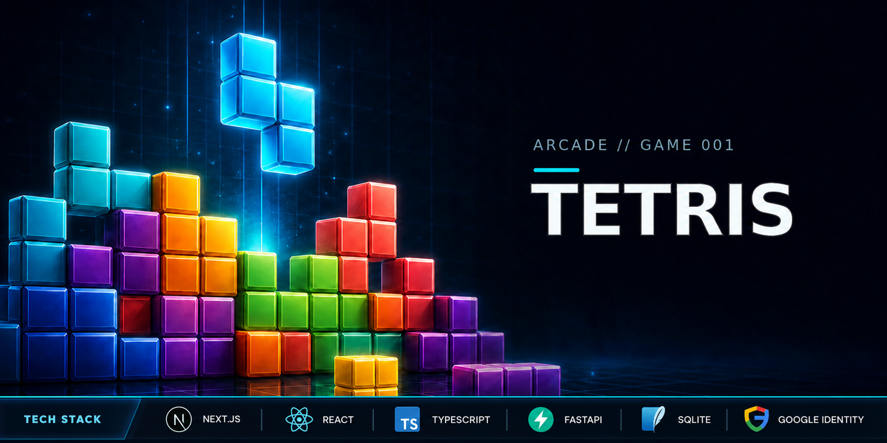
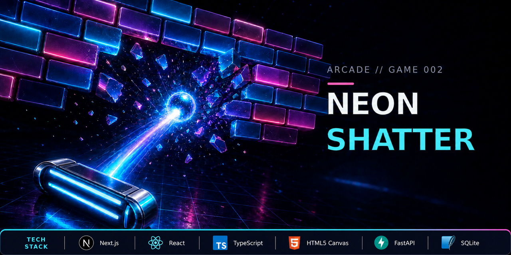

# Arcade

A SaaS-style classic arcade collection. Each game lives in its own directory with a Next.js frontend and FastAPI backend.

Production can use the shared serverless API in `backend/serverless`. It consolidates both games behind API Gateway and Lambda with DynamoDB persistence while preserving the SQLite services used by the local launcher.

Authentication uses Google Identity Services directly. See `docs/google-auth-setup.md` before running either game.

## Games

### Tetris



Playable Tetris with login, automatic score saving, player stats, and a top-ten leaderboard.

### Neon Shatter



Neon brick breaker with escalating sectors, combo scoring, touch controls, accounts, and leaderboards.

## Local Development

The root launcher starts both backends and both frontends in one terminal. On the
first run, create a shared local environment file:

```bash
cp .env.example .env.local
```

Edit `.env.local` with the Google Web Client ID used by the frontend and a newly
generated `ARCADE_SECRET`. Keep quotes around secret values, especially when they
contain characters such as `!`. You can generate a fresh secret with:

```bash
python3 -c 'import secrets; print(secrets.token_urlsafe(48))'
```

Then launch the complete arcade:

```bash
./start-arcade.sh
```

The script creates missing Python virtual environments or frontend installs,
loads the shared environment once, and starts:

- Tetris frontend: `http://localhost:3000`
- Tetris backend: `http://localhost:8000`
- Neon Shatter frontend: `http://localhost:3001`
- Neon Shatter backend: `http://localhost:8001`

Press `Ctrl+C` to stop all four services. To use a different environment file,
set `ARCADE_ENV_FILE` to its path before launching.

The launcher passes the same Google client ID to every service, preventing
frontend/backend token-audience mismatches. The root `.env.local`, databases,
virtual environments, and frontend build output are ignored by Git.

## Per-game Documentation

See `tetris/README.md`, `neon-shatter/README.md`, and
`docs/google-auth-setup.md` for manual setup, environment variables, controls,
and production-domain configuration.

-Author: Jeremy Demers

## Serverless deployment

See `backend/serverless/README.md` for the shared Lambda API, DynamoDB data model, Terraform configuration, secret setup, and deployment workflow.

-Author: Jeremy Demers
